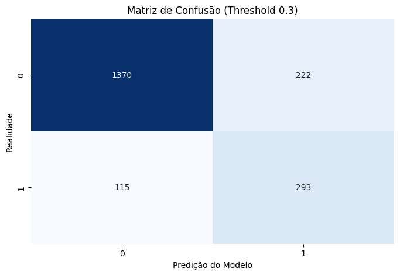
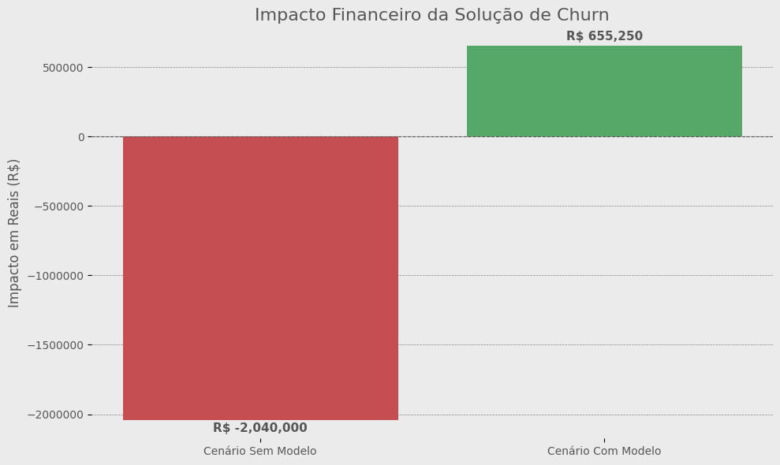
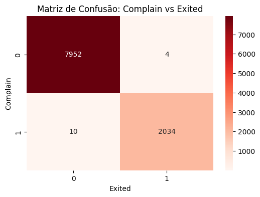
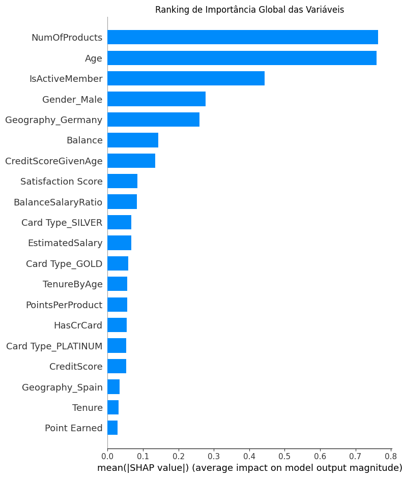

# One Bank — Previsão de Churn Bancário

<p align="center">
  <strong>EDA · Feature Engineering · Comparação de Modelos · Threshold Tuning · SHAP · Simulação de ROI</strong>
</p>

---

## Achado central

> O modelo XGBoost com threshold otimizado (30%) detecta **71,8% dos clientes em risco de churn**, gerando um resultado líquido estimado de **+R$ 655 mil** vs. R$ 2 milhões de perda no cenário sem modelo.

| Métrica | Valor |
|---|---|
| Base de clientes | 10.000 |
| Taxa de churn | ~20% |
| Acurácia | 83,15% |
| Recall (métrica principal) | 71,81% |
| Precisão | 56,89% |
| ROI estimado | +R$ 655.250 |

| | |
|---|---|
|  |  |
| Threshold otimizado (30%): mais detecção, menos perda | Modelo transforma prejuízo de R$2M em lucro de R$655k |

---

## Stack

<p align="center">
  
  
  
  
  
  
</p>

Python · pandas · scikit-learn · XGBoost · imbalanced-learn (SMOTE) · SHAP · matplotlib · seaborn

---

## Destaques técnicos

### Data Leakage detectado e removido

A variável `Complain` apresentou correlação de **~99% com a variável alvo** (`Exited`). Incluí-la no modelo geraria acurácia artificialmente inflada que não se sustentaria em produção. Foi removida antes da modelagem.

| | |
|---|---|
|  | A matriz mostra classificação quase perfeita — sinal claro de Data Leakage. Identificar e remover essa variável foi essencial para construir um modelo honesto. |

### Comparação de modelos com Cross-Validation

3 modelos avaliados com **validação cruzada estratificada (5-fold)**:

| Modelo | Recall | F1-Score | AUC-ROC |
|---|---|---|---|
| Logistic Regression | **0.7252** ± 0.0161 | 0.4809 ± 0.0115 | 0.7514 ± 0.0083 |
| Random Forest | 0.4945 ± 0.0081 | 0.5903 ± 0.0082 | 0.8509 ± 0.0089 |
| XGBoost | 0.5025 ± 0.0098 | **0.5925** ± 0.0120 | **0.8614** ± 0.0079 |

**Por que XGBoost?** Logistic Regression teve maior Recall bruto, porém com F1 e AUC significativamente inferiores. O XGBoost com threshold otimizado para 30% alcança Recall equivalente (71,8%) com melhor capacidade de discriminação — menos falsos positivos, menor custo operacional.

### Interpretabilidade com SHAP



Ranking de importância global das variáveis — permite explicar **por que** o modelo tomou cada decisão.

---

## Feature Engineering

Variáveis sintéticas criadas com lógica de negócio:

| Feature | Lógica |
|---|---|
| `CreditScoreGivenAge` | Score normalizado pela idade — 600 é bom para jovem, ruim para idoso |
| `HasBalance` | Flag binária — clientes com saldo zero tendem a ser "fantasmas" |
| `PointsPerProduct` | Engajamento real — pontos por produto contratado |
| `BalanceSalaryRatio` | Capacidade de poupança — saldo relativo ao salário |
| `TenureByAge` | Fidelidade proporcional à idade do cliente |

---

## Impacto financeiro


| Cenário | Resultado |
|---|---|
| 🔴 Sem modelo (reativo) | -R$ 2.040.000 em clientes perdidos |
| 🟢 Com modelo (proativo) | +R$ 655.250 de resultado líquido |

**Premissas conservadoras:** LTV médio R$ 5.000 · Custo de retenção R$ 150 · Taxa de sucesso 50%

---

## Simulação de produção

O pipeline salvo aceita **JSON bruto** como entrada — pronto para consumo via API:

```python
cliente = {
  "CreditScore": 350, "Geography": "Germany", "Gender": "Female",
  "Age": 55, "Tenure": 1, "Balance": 150000.00, "NumOfProducts": 1,
  "HasCrCard": 1, "IsActiveMember": 0, "EstimatedSalary": 50000.00,
  "Satisfaction Score": 1, "Point Earned": 200, "CardType": "GOLD"
}
# → Probabilidade: 91.85% → ALERTA: RISCO DE CHURN
```

---

## Estrutura do projeto

```
One_Bank_Churn_Prediction.ipynb   # Notebook único com pipeline completo
├── 1. Contexto e Objetivos
├── 2. Carregamento e Inspeção
├── 3. Análise Exploratória (EDA)
│   ├── 3.1 Análise Univariada
│   ├── 3.2 Heatmap de Correlação
│   ├── 3.3 Detecção de Data Leakage
│   ├── 3.4 Análise Bivariada (6 hipóteses)
│   ├── 3.5 Identificação de Outliers
│   └── 3.6 Principais Achados
├── 4. Feature Engineering
├── 5. Modelagem
│   ├── 5.1 Preparação dos Dados
│   ├── 5.2 Comparação de Modelos (Cross-Validation)
│   ├── 5.3 Pipeline Final (XGBoost)
│   └── 5.4 Otimização de Threshold
├── 6. Interpretabilidade (SHAP)
├── 7. Impacto Financeiro (ROI)
└── 8. Exportação e Simulação de Produção
```

---

## Dataset

[Bank Customer Churn — Kaggle](https://www.kaggle.com/datasets/radheshyamkollipara/bank-customer-churn) · 10.000 registros · 18 variáveis

## Como executar

**Google Colab (recomendado):**
Abra o notebook no Colab e execute todas as células. Todas as dependências já vêm pré-instaladas.

**Localmente:**
```bash
pip install -r requirements.txt
```

1. Baixe o dataset do Kaggle
2. Abra o notebook no Google Colab ou Jupyter
3. Execute todas as células sequencialmente

---

## Autores

- **Antonio Sergio Castro de Carvalho Junior** ([@ASCCJR](https://github.com/ASCCJR))
- **Pedro Camargo** ([@Pdrnho](https://github.com/Pdrnho))
